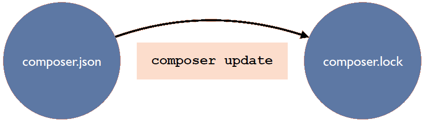

# TP - Composer

---
## Objet de ce TP

Le but de ce TP est d'utiliser un gestionnaire de dépendances nommé `composer`.


Un gestionnaire de dépendances est un outil qui va centraliser toutes les dépendances de votre **projet** en un seul endroit.

En effet, l’un des nombreux problèmes auxquels sont confrontés les développeurs sont les dépendances. 

Ils existent d'autres gestionnaires de dépendances par projet, dans d'autres languages, comme `pip` pour Python et `npm` pour Node.js.

Nous allons créer un petit projet en PHP, en utilisant `composer`, qui va mémoriser dans un fichier `log` l'heure de chaque visite de la page web.

Documentation sur `composer` : `https://getcomposer.org/doc/01-basic-usage.md`

> Pour info, `https://packagist.org` est le dépot par défaut de `composer`.


---
## Installer les outils nécessaires

1. installer `composer` : https://getcomposer.org/download/
2. si besoin, installer `git` : https://git-scm.com/downloads/
3. si besoin, installer `Visual Studio Code` : https://code.visualstudio.com/


---
## Créer un dépôt dans Github "composer-tp"

1. se connecter à Github
2. créer le dépot "composer-tp" (.gitignore `Composer` + LICENSE `MIT` + README)
3. copier l'adresse `https://...` du dépôt
4. ouvrir le terminal Windows, et se placer dans le dossier avec vos initiales (par exemple D:\LB)
5. exécuter la commande `git clone ` suivi par l'adresse `https://...` du dépôt (par exemple `git clone https://github.com/VOTRE-COMPTE/composer-tp.git`)
6. `cd composer-tp`


---
## Créer le projet 

1. composer init
- Package name : VOTRE-NOM/composer-tp
- Description : Small project to learn the composer tool
- Author : VOTRE-NOM \<VOTRE-ADRESSE-EMAIL\>
- Minimum Stability : stable
- Package Type : project
- License : MIT
- Would you like to define your dependencies : no
- Would you like to define your dev dependencies : no
- Do you confirm generation : yes

---
2. `composer install`

---
3. code .

---
4. vérifier le contenu du fichier `composer.json`
> Le fichier `composer.json` peut être considéré comme une liste de recherche pour `composer`. Grâce à cette liste, `composer` ne téléchargera que les packages (dépendances) de votre projet qui sont mentionnés dans ce fichier. Il vérifie également la compatibilité des versions des packages avec votre projet. 

---
5. installer le package de Monolog :
```
composer require monolog/monolog
```
> L'opération, de téléchargement des dépendances, peut être longue...

---
6. vérifier, à nouveau, le contenu du fichier `composer.json`
> Dans la ligne `"monolog/monolog": "^2.0"`, **l'accent circonflexe** (`^`) est destiné à permettre toutes les mises à jour sans changement majeur. Cela signifie simplement que chaque fois que le signe apparaît devant une version, `composer` autorisera toujours les mises à jour compatibles. Dans notre cas, `composer` autorisera les mises à jour du paquet de la **version 2.0 à 3.0**, car 3.0 annulera la compatibilité.

---
7. vérifier le contenu du dossier `vendor`, 
   (et notamment le fichier `autoload.php`)

---
8. créer le dossier `src` 
> Ce dossier va contenir les fichiers sources de notre projet PHP.

---
9. créer le dossier `log` 
> Ce dossier va contenir le fichier qui tracent les messages générés lors de l'exécution de notre projet (`app.log`).

---
10. ajouter les lignes suivantes dans le fichier `composer.json` (ajouter si besoin une virgule) :
```
    "autoload": {
        "psr-4": { "App\\": "src/" }
    }
```

---
11. créer le fichier `src/index.php` :
```
<?php
require_once '../vendor/autoload.php';

use Monolog\Handler\StreamHandler;
use Monolog\Logger;

$logger = new Logger('main');
$logger->pushHandler(new StreamHandler(__DIR__ . '/../log/app.log', Logger::DEBUG));

$logger->info('First message');

print('Le message est enregistré dans le fichier ' . __DIR__ . '/../log/app.log');
```
> Pour intégrer les dépendances de votre projet, il suffit d’ajouter le code `require_once 'vendor/autoload.php';` dans les fichiers PHP.

---
12. démarrer le serveur web : `php -S localhost:8000 -t src` 

---
13. ouvrir la page `http://localhost:8000` avec votre navigateur favoris

---
14. vérifier l'écriture du fichier `log/app.log`

---
15. envoyer les fichiers sources vers votre dépôt sur Github :
```
git add .
git commit -m "First commit"
git push
```

---
16. vérifier l'arrivée de vos fichiers sur `https://github.com/VOTRE-COMPTE/composer-tp`


---
17. Rôle du fichier `composer.lock`



---
18. Voici les niveaux de journalisation de `Monolog` :
- DEBUG = informations de débogage détaillées
- INFO = événements intéressants
- NOTICE = événements normaux mais significatifs
- WARNING = événements exceptionnels qui ne sont pas des erreurs
- ERROR = erreurs d'exécution qui ne nécessitent pas d'action immédiate
- CRITICAL = erreurs critiques
- ALERT = événements pour lesquels une action doit être prise immédiatement
- EMERGENCY = événements d'urgence
